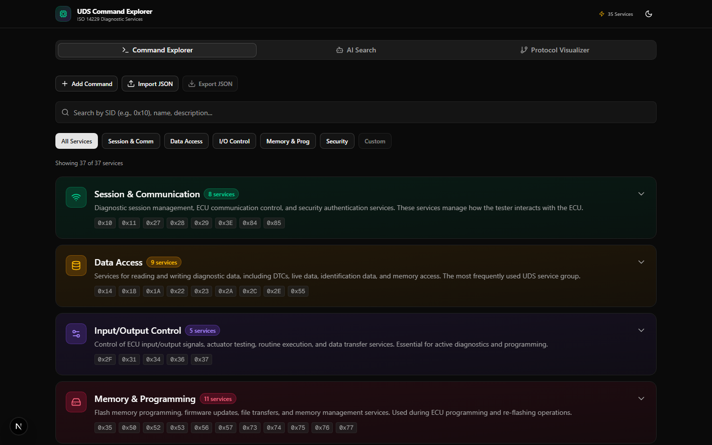
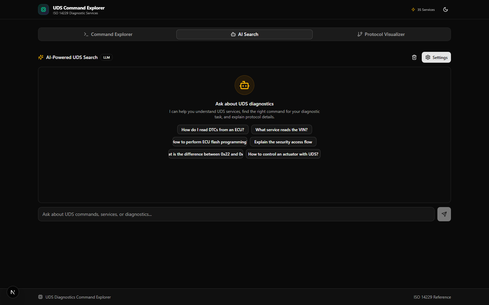
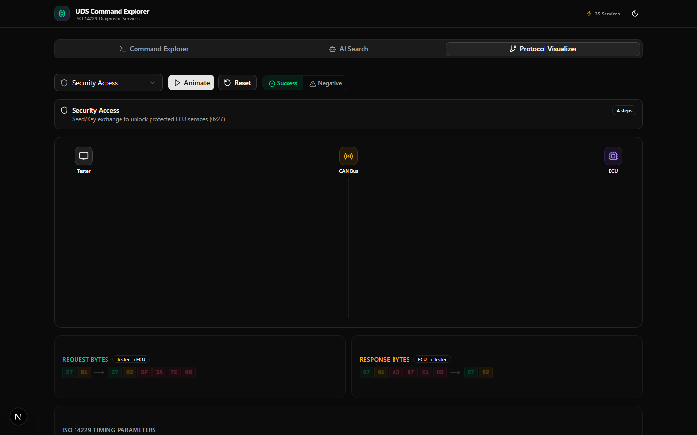

# UDS Diagnostics Explorer

**Live app: [uds-diagnostics-explorer.vercel.app](https://uds-diagnostics-explorer.vercel.app)**

Interactive web app for exploring, searching, and visualizing UDS (Unified Diagnostic Services, ISO 14229) automotive diagnostic commands. Built as a reference tool for automotive engineers and diagnostics developers.

## Features

### Command Explorer
Search and filter 35+ built-in UDS commands across 5 service groups. Create, edit, and organize custom commands. Import/export custom command sets as JSON.



### AI Search
Chat interface powered by OpenAI-compatible APIs. Ask natural language questions about UDS services, DIDs, and diagnostic procedures. Supports both local LLMs (direct browser calls) and cloud LLMs (proxied server-side to protect API keys).



### Protocol Visualizer
Animated sequence diagrams showing Tester ↔ CAN Bus ↔ ECU message flows. Step-by-step playback with color-coded hex byte breakdown (SID, sub-function, parameter, data bytes).



## Tech Stack

- **Framework:** Next.js 16 (App Router, standalone output)
- **Language:** TypeScript
- **Styling:** Tailwind CSS v4
- **UI Components:** shadcn/ui (new-york style)
- **State Management:** Zustand v5 (localStorage persistence)
- **Animations:** Framer Motion v12

## Getting Started

```bash
npm install
npm run dev
```

Open [http://localhost:3000](http://localhost:3000) in your browser.

## Commands

| Command | Description |
|---------|-------------|
| `npm run dev` | Dev server on port 3000 |
| `npm run build` | Production build (standalone output) |
| `npm run start` | Start production server |
| `npm run lint` | ESLint |
| `npm run db:push` | Push Prisma schema to SQLite |
| `npm run db:generate` | Generate Prisma client |

## Color Coding

Groups and hex byte types share a consistent color scheme:

| Group / Byte Type | Color |
|-------------------|-------|
| Session & Communication / SID | Emerald |
| Data Access / Sub-function | Amber |
| Input/Output Control / Parameter | Violet |
| Memory & Programming / Data | Rose |
| Security | Slate |
| Custom Commands | Cyan |

## AI Provider Configuration

The AI Search tab supports any OpenAI-compatible API endpoint. Cloud providers are proxied through `/api/uds-search` to protect API keys. Local LLMs are called directly from the browser.

Supported provider domains include: OpenAI, DeepSeek, Mistral, Groq, Together AI, Fireworks, Perplexity, Cerebras, SambaNova, AI21, OpenRouter, and custom internal gateways.

## Architecture

- UDS command data embedded in `src/lib/uds-data.ts` (no external database)
- Custom commands managed via Zustand store with localStorage persistence
- AI search system prompt built from `generateDatabaseContext()` + custom commands
- Protocol sequences defined in `src/lib/uds-sequences.ts`
- All UI components in `src/components/uds/`
- API proxy route in `src/app/api/uds-search/route.ts`